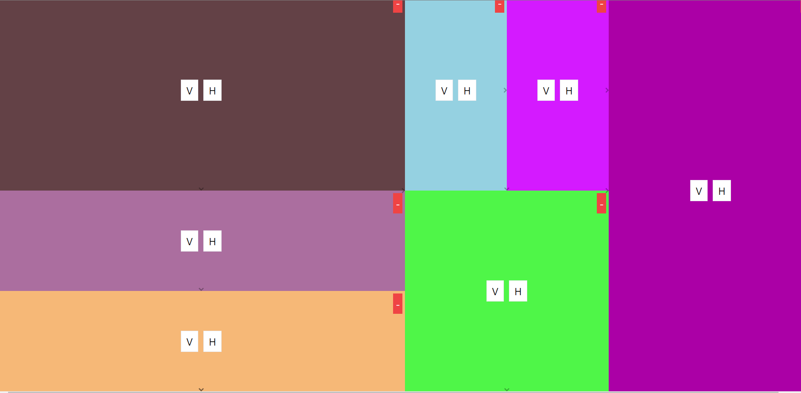

# Recursive Partitioning Layout Builder

A responsive layout builder built with React.js and Tailwind CSS. This application allows users to recursively partition a screen into smaller sections, with each section having its own controls to further split, resize, or remove partitions.

## Features

- **Vertical and Horizontal Splitting**: Click the 'V' button to split a partition vertically and the 'H' button to split it horizontally.
- **Random Colors**: Each new partition is assigned a random color.
- **Recursive Partitioning**: Newly created partitions can also be split further.
- **Resizable Partitions**: Click and drag to resize the partitions.
- **Removable Partitions**: Remove any partition using the '-' button.

## Demo



## Installation

1. Clone the repository:

    ```bash
    git clone https://github.com/your-username/recursive-partitioning.git
    cd recursive-partitioning
    ```

2. Install dependencies:

    ```bash
    npm install
    ```

3. Run the development server:

    ```bash
    npm run dev
    ```

4. Open your browser and navigate to:

    ```
    http://localhost:5173/
    ```

## Usage

- Start with an initial partition with 'V' and 'H' buttons.
- Click 'V' to split the partition vertically or 'H' to split it horizontally.
- Resize partitions by clicking and dragging the borders.
- Remove a partition by clicking the '-' button in the top-right corner of the partition.

## Technologies Used

- [React.js](https://reactjs.org/)
- [Tailwind CSS](https://tailwindcss.com/)
- [Vite](https://vitejs.dev/)
- [React Resizable](https://react-grid-layout.github.io/react-resizable/index.html/)


## Project Structure

